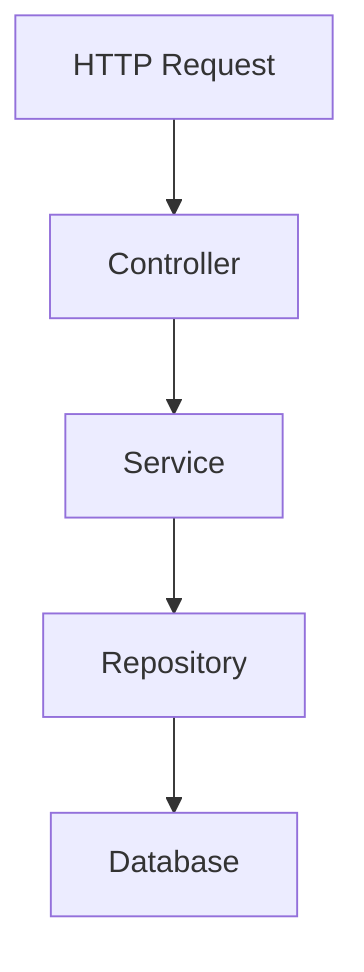

# フリーランス向け案件管理システム


フリーランスエンジニア向けの案件管理APIです。

クライアント情報、案件情報を管理し、クライアントごとに案件を紐づけて管理できるようにしています。
Spring Bootを用いたREST API開発、例外ハンドリング、テスト、GitHub ActionsによるCIを実践するために作成しています。

## 概要

このアプリケーションでは、以下の情報を管理します。

- クライアント情報
- 案件情報
- クライアントと案件の紐付け

フリーランスとして案件を管理する場合、案件は必ず依頼元となるクライアントに紐づきます。
そのため、本アプリケーションでは `Client 1件に対して Project 複数件` という関係で管理しています。

Client 1 --- * Project

## 実装済み機能

### Client機能

- クライアント登録
- クライアント一覧取得
- クライアント詳細取得
- クライアント更新
- クライアント削除

### Project機能

- 案件登録
- 案件一覧取得
- 案件詳細取得
- 案件更新
- 案件削除

### Client-Project関連

- Project登録時にClientを指定
- クライアント別のProject一覧取得
- Projectが存在するClientの削除制御

### エラー処理

- 存在しないID指定時の `404 Not Found`
- 入力値不正時の `400 Bad Request`
- 関連データが存在する場合の `409 Conflict`
- Enumに存在しない値が指定された場合のエラーハンドリング

### テスト・CI

- Service層の単体テスト
- Controller層のテスト
- GitHub Actionsによる自動テスト・ビルド

## 仕様技術

| 分類 | 技術 |
| --- | --- |
| 言語 | Java |
| フレームワーク | Spring Boot |
| Web | Spring Web |
| ORM | Spring Data JPA |
| DB | H2 Database |
| Validation | Bean Validation |
| Test | JUnit, Mockito, MockMvc |
| CI | GitHub Actions |
| Build Tool | Gradle |

## API一覧

### Client API

| メソッド | パス | 説明 |
| --- | --- | --- |
| POST | `/api/clients` | クライアントを登録する |
| GET | `/api/clients` | クライアント一覧を取得する |
| GET | `/api/clients/{id}` | 指定したクライアントを取得する |
| PUT | `/api/clients/{id}` | 指定したクライアントを更新する |
| DELETE | `/api/clients/{id}` | 指定したクライアントを削除する |
| GET | `/api/clients/{clientId}/projects` | 指定したクライアントに紐づく案件一覧を取得する |

### Project API

| メソッド | パス | 説明 |
| --- | --- | --- |
| POST | `/api/projects` | 案件を登録する |
| GET | `/api/projects` | 案件一覧を取得する |
| GET | `/api/projects/{id}` | 指定した案件を取得する |
| PUT | `/api/projects/{id}` | 指定した案件を更新する |
| DELETE | `/api/projects/{id}` | 指定した案件を削除する |

## ドキュメント

詳細な設計は以下に記載しています。

- [Client CRUD API設計](docs/client-api.md)
- [Project CRUD API設計](docs/project-api.md)
- [ClientとProjectの紐付け](docs/client-project-relation.md)

## パッケージ構成

```text
src/main/java/com/example/freelancemanager
 ├── client 
 │ ├── Client.java 
 │ ├── ClientRepository.java 
 │ ├── ClientService.java 
 │ ├── ClientController.java 
 │ ├── ClientCreateRequest.java 
 │ ├── ClientUpdateRequest.java 
 │ └── ClientResponse.java 
 ├── project 
 │ ├── Project.java 
 │ ├── ProjectRepository.java 
 │ ├── ProjectService.java 
 │ ├── ProjectController.java 
 │ ├── ProjectCreateRequest.java 
 │ ├── ProjectUpdateRequest.java 
 │ ├── ProjectResponse.java 
 │ ├── ContractType.java 
 │ └── ProjectStatus.java 
 └── common 
   ├── ErrorResponse.java 
   ├── NotFoundException.java 
   ├── ConflictException.java 
   └── GlobalExceptionHandler.java
```

## 処理の流れ

基本的なAPIの処理は、以下の流れで実行します。



## ローカルでの起動方法

### 前提

- Java 21
- Git
- Gradle Wrapperを使用

### リポジトリを取得

```bash
git clone https://github.com/yumeya-nagasaki/freelance-manager.git
cd freelance-manager
```

### アプリケーション起動

macOS / Linux の場合:

```bash
./gradlew bootRun
```

Windows PowerShell の場合:

```powershell
gradlew.bat bootRun
```

起動後、以下のURLでAPIにアクセスできます。

```text
http://localhost:8080
```

### テスト実行

macOS / Linux の場合:

```bash
./gradlew test
```

Windows PowerShell の場合:

```powershell
gradlew.bat test
```

## 動作確認例

### Client登録

Windows PowerShellから日本語を含むJSONを送信する場合、UTF-8のバイト配列として送信します。

```powershell
$body = @{
  name = "Example株式会社"
  email = "contact@example.com"
  memo = "初回登録"
} | ConvertTo-Json

$utf8Body = [System.Text.Encoding]::UTF8.GetBytes($body)

Invoke-RestMethod `
  -Uri "http://localhost:8080/api/clients" `
  -Method Post `
  -ContentType "application/json; charset=utf-8" `
  -Body $utf8Body
```

### Project登録

```powershell
$body = @{
  clientId = 1
  name = "業務管理システム開発"
  contractType = "MONTHLY"
  unitPrice = 600000
  workRate = 100
  startDate = "2026-06-01"
  endDate = "2026-12-31"
  status = "ACTIVE"
  memo = "Spring Bootを使用した業務システム開発案件"

} | ConvertTo-Json

$utf8Body = [System.Text.Encoding]::UTF8.GetBytes($body)

Invoke-RestMethod `
  -Uri "http://localhost:8080/api/projects" `
  -Method Post `
  -ContentType "application/json; charset=utf-8" `
  -Body $utf8Body
```

### クライアント別Project一覧取得

```powershell
[Console]::OutputEncoding = [System.Text.Encoding]::UTF8

Invoke-RestMethod `
  -Uri "http://localhost:8080/api/clients/1/projects" `
  -Method Get
```

## エラーレスポンス例

### 存在しないIDを指定した場合

```json
{
  "status": 404,
  "error": "Not Found",
  "message": "client not found. id=999",
  "path": "/api/clients/999",
  "timestamp": "2026-05-14T23:34:52.9999772"
}
```

### 入力値が不正な場合

```json
{
  "status": 400,
  "error": "Bad Request",
  "message": "email: 電子メールアドレスとして正しい形式にしてください",
  "path": "/api/clients",
  "timestamp": "2026-05-14T23:37:27.7998495"
}
```

### 関連データが紐づいている場合

Projectが紐づいているClientを削除しようとした場合、`409 Conflict` を返します。

```json
{
  "status": 409,
  "error": "Conflict",
  "message": "client has projects. id=1",
  "path": "/api/clients/1",
  "timestamp": "2026-05-18T22:00:00"
}
```

## 今後の実装予定

- APIの追加
- PostgreSQL対応
- Docker Compose対応
- Cloud Runへのデプロイ

## 開発目的

このリポジトリは、Spring Bootによる業務アプリケーション開発の理解を深めるために作成しています。

特に以下を意識しています。

- REST APIの設計
- Controller / Service / Repository の責務分離
- DTOによる入出力の分離
- Bean Validationによる入力チェック
- 共通例外ハンドリング
- Service / Controller のテスト
- GitHub ActionsによるCI
- Pull Requestベースの開発フロー
