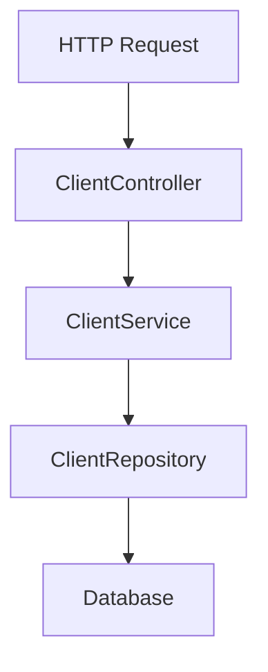

# フリーランス向け案件管理システム
## Client CRUD API設計
### 概要
クライアント情報を管理するためのAPIです。
フリーランス案件管理システムにおいて、案件は必ずクライアントに紐づくため、最初の基本機能としてClient CRUD APIを実装します。

### 対象データ
Clientは、案件を依頼する企業または担当者の情報を表します。

| 項目 | 型 | 必須 | 説明 |
| --- | --- | ---:| --- |
| id | Long | ○ | クライアントID |
| name | String | ○ | クライアント名 |
| email | String | - | 連絡先メールアドレス |
| memo | String | - | 備考 |
| createdAt | LocalDateTime | ○ | 作成日時 |
| updatedAt | LocalDateTime | ○ | 更新日時 |

### API一覧

| メソッド | パス | 説明 |
| --- | --- | --- |
| POST | `/api/clients` | クライアントを登録する |
| GET | `/api/clients` | クライアント一覧を取得する |
| GET | `/api/clients/{id}` | 指定したクライアントを取得する |
| PUT | `/api/clients/{id}` | 指定したクライアントを更新する |
| DELETE | `/api/clients/{id}` | 指定したクライアントを削除する |

### パッケージ構成

```text
src/main/java/com/example/freelancemanager/client
├── Client.java
├── ClientRepository.java
├── ClientService.java
├── ClientController.java
├── ClientCreateRequest.java
├── ClientUpdateRequest.java
└── ClientResponse.java
```

### 各クラスの役割

| クラス | 役割 |
| --- | --- |
| Client | クライアント情報を表すEntity |
| ClientRepository | ClientのDB操作を担当するRepository |
| ClientService | Clientに関する業務処理を担当するService |
| ClientController | HTTPリクエストを受け付けるController |
| ClientCreateRequest | 登録APIのリクエストDTO |
| ClientUpdateRequest | 更新APIのリクエストDTO |
| ClientResponse | レスポンスDTO |

### 処理の流れ



### 動作確認用コマンド

Powershellから実行する場合は以下のコマンドで確認する

* 登録
```text
$body = @{
  name = "Example株式会社"
  email = "contact@example.com"
  memo = "初回登録"
} | ConvertTo-Json

$utf8Body = [System.Text.Encoding]::UTF8.GetBytes($body)

Invoke-RestMethod `
  -Uri "http://localhost:8080/api/clients" `
  -Method Post `
  -ContentType "application/json; charset=utf-8" `
  -Body $utf8Body
```

* 一覧取得
```text
[Console]::OutputEncoding = [System.Text.Encoding]::UTF8

Invoke-RestMethod `
  -Uri "http://localhost:8080/api/clients" `
  -Method Get
```

* 取得
```text
[Console]::OutputEncoding = [System.Text.Encoding]::UTF8

Invoke-RestMethod `
  -Uri "http://localhost:8080/api/clients/1" `
  -Method Get
```

* 更新
```text
$body = @{
  name = "Example株式会社"
  email = "contact@example.com"
  memo = "更新しました"
} | ConvertTo-Json

$utf8Body = [System.Text.Encoding]::UTF8.GetBytes($body)

Invoke-RestMethod `
  -Uri "http://localhost:8080/api/clients/1" `
  -Method Put `
  -ContentType "application/json; charset=utf-8" `
  -Body $utf8Body
```

* 削除
```text
[Console]::OutputEncoding = [System.Text.Encoding]::UTF8

Invoke-RestMethod `
  -Uri "http://localhost:8080/api/clients/1" `
  -Method Delete
```