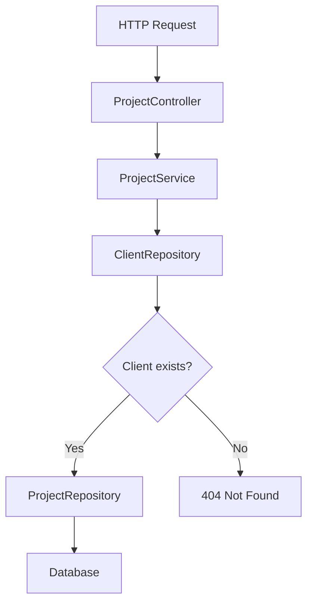
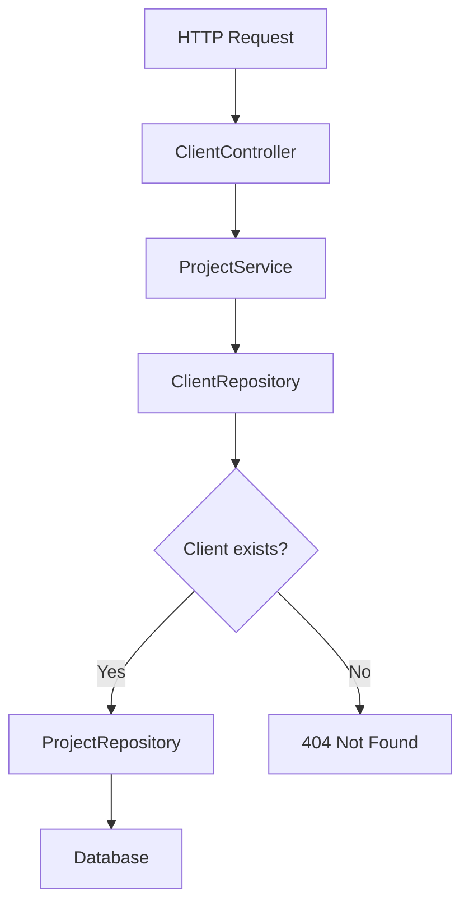

# フリーランス向け案件管理システム

## Client-Project 関連設計

### 概要

ClientとProjectを関連付け、どのクライアントの案件であるかを管理できるようにします。

フリーランス案件管理システムでは、案件は必ず依頼元となるクライアントに紐づきます。  
そのため、Project登録時に `clientId` を指定し、ProjectがどのClientに属するかを管理します。

### 関連

ClientとProjectの関係は、以下の通りです。

```text
Client 1 --- * Project
```

* 1つのClientは複数のProjectを持つことができます
* 1つのProjectは必ず1つのClientに紐づきます
* Projectテーブルは `client_id` を持ちます

### 対象データの変更

Projectに `clientId` を追加します。

| 項目 | 型 | 必須 | 説明 |
| --- | --- | ---: | --- |
| clientId | Long | ○ | Projectが紐づくClientのID |

### Project登録時のリクエスト例

```json
{
  "clientId": 1,
  "name": "業務管理システム開発",
  "contractType": "MONTHLY",
  "unitPrice": 600000,
  "workRate": 100,
  "startDate": "2026-06-01",
  "endDate": "2026-12-31",
  "status": "ACTIVE",
  "memo": "Spring Bootを使用した業務システム開発案件"
}
```

### Projectレスポンス例

```json
{
  "id": 1,
  "clientId": 1,
  "name": "業務管理システム開発",
  "contractType": "MONTHLY",
  "unitPrice": 600000,
  "workRate": 100,
  "startDate": "2026-06-01",
  "endDate": "2026-12-31",
  "status": "ACTIVE",
  "memo": "Spring Bootを使用した業務システム開発案件",
  "createdAt": "2026-05-18T22:00:00",
  "updatedAt": "2026-05-18T22:00:00"
}
```

### 追加API

クライアントに紐づく案件一覧を取得するAPIを追加します。

| メソッド | パス | 説明 |
| --- | --- | --- |
| GET | `/api/clients/{clientId}/projects` | 指定したClientに紐づくProject一覧を取得する |

### 処理の流れ

#### Project登録



#### クライアント別Project一覧取得



### パッケージクラスの変更

ProjectとClientの関連付けに伴い、主に以下を変更します。

| クラス | 変更内容 |
| --- | --- |
| Project | Clientとの関連を追加 |
| ProjectCreateRequest | clientIdを追加 |
| ProjectResponse | clientIdを追加 |
| ProjectRepository | clientIdによる検索メソッドを追加 |
| ProjectService | Project登録時にClient存在チェックを追加 |
| ClientController | クライアント別Project一覧取得APIを追加 |

### バリデーション・エラー方針

Project登録時に存在しない `clientId` が指定された場合、`404 Not Found` を返します。

```json
{
  "status": 404,
  "error": "Not Found",
  "message": "client not found. id=999",
  "path": "/api/projects",
  "timestamp": "2026-05-18T22:00:00"
}
```

クライアント別Project一覧取得時に存在しない `clientId` が指定された場合も、`404 Not Found` を返します。

```json
{
  "status": 404,
  "error": "Not Found",
  "message": "client not found. id=999",
  "path": "/api/clients/999/projects",
  "timestamp": "2026-05-18T22:00:00"
}
```

Client削除時にProjectが存在する場合、`409 Conflict` を返します。

```json
{
  "status": 409,
  "error": "Conflict",
  "message": "client has projects. id=1",
  "path": "/api/clients/1",
  "timestamp": "2026-05-18T22:00:00"
}
```
