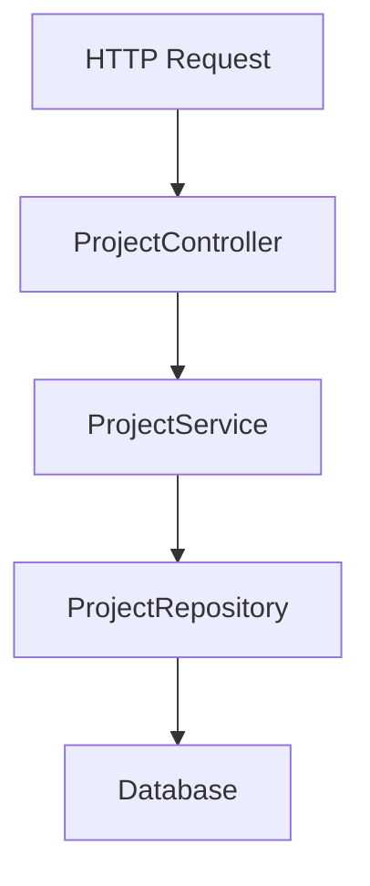

# フリーランス向け案件管理システム

## Project CRUD API設計

### Project CRUD APIの概要

案件情報を管理するためのAPIです。
フリーランス案件管理システムにおいて、Projectは実際に受注・参画する案件を表します。

初期実装では、Project単体のCRUD APIを作成します。
Clientとの関連付けは後続の実装で追加予定です。

### Project CRUD APIの対象データ

Projectは、フリーランスが管理する案件情報を表します。

| 項目 | 型 | 必須 | 説明 |
| --- | --- | ---: | --- |
| id | Long | ○ | 案件ID |
| name | String | ○ | 案件名 |
| contractType | ContractType | ○ | 契約形態 |
| unitPrice | Integer | ○ | 単価 |
| workRate | Integer | ○ | 稼働率 |
| startDate | LocalDate | ○ | 開始日 |
| endDate | LocalDate | - | 終了日 |
| status | ProjectStatus | ○ | 案件ステータス |
| memo | String | - | 備考 |
| createdAt | LocalDateTime | ○ | 作成日時 |
| updatedAt | LocalDateTime | ○ | 更新日時 |

### 契約状態

ContractTypeは、案件の契約形態を表します。

| 値 | 説明 |
| --- | --- |
| FIXED_PRICE | 固定報酬 |
| MONTHLY | 月額契約 |
| HOURLY | 時間単価契約 |

### 案件ステータス

ProjectStatusは、案件の状態を表します。

| 値 | 説明 |
| --- | --- |
| PREPARING | 準備中 |
| ACTIVE | 進行中 |
| SUSPENDED | 一時停止 |
| COMPLETED | 完了 |
| CANCELED | キャンセル |

### Project CRUD API一覧

| メソッド | パス | 説明 |
| --- | --- | --- |
| POST | `/api/projects` | 案件を登録する |
| GET | `/api/projects` | 案件一覧を取得する |
| GET | `/api/projects/{id}` | 指定した案件を取得する |
| PUT | `/api/projects/{id}` | 指定した案件を更新する |
| DELETE | `/api/projects/{id}` | 指定した案件を削除する |

### Project CRUD APIのパッケージ構成

```text
src/main/java/com/example/freelancemanager/project
├── Project.java
├── ProjectRepository.java
├── ProjectService.java
├── ProjectController.java
├── ProjectCreateRequest.java
├── ProjectUpdateRequest.java
├── ProjectResponse.java
├── ContractType.java
└── ProjectStatus.java
```

### Project CRUD APIの各クラスの役割

| クラス | 役割 |
| --- | --- |
| Project | 案件情報を表すEntity |
| ProjectRepository | ProjectのDB操作を担当するRepository |
| ProjectService | Projectに関する業務処理を担当するService |
| ProjectController | HTTPリクエストを受け付けるController |
| ProjectCreateRequest | 登録APIのリクエストDTO |
| ProjectUpdateRequest | 更新APIのリクエストDTO |
| ProjectResponse | レスポンスDTO |
| ContractType | 契約形態を表すEnum |
| ProjectStatus | 案件ステータスを表すEnum |

### Project CRUD APIの処理の流れ



### リクエスト例

* 登録

```json
{
  "name": "業務管理システム開発",
  "contractType": "MONTHLY",
  "unitPrice": 600000,
  "workRate": 100,
  "startDate": "2026-06-01",
  "endDate": "2026-12-31",
  "status": "ACTIVE",
  "memo": "Spring Bootを使用した業務システム開発案件"
}
```

* 更新

```json
{
  "name": "業務管理システム開発",
  "contractType": "MONTHLY",
  "unitPrice": 650000,
  "workRate": 100,
  "startDate": "2026-06-01",
  "endDate": "2026-12-31",
  "status": "ACTIVE",
  "memo": "単価変更あり"
}
```

### レスポンス例

```json
{
  "id": 1,
  "name": "業務管理システム開発",
  "contractType": "MONTHLY",
  "unitPrice": 600000,
  "workRate": 100,
  "startDate": "2026-06-01",
  "endDate": "2026-12-31",
  "status": "ACTIVE",
  "memo": "Spring Bootを使用した業務システム開発案件",
  "createdAt": "2026-05-18T22:00:00",
  "updatedAt": "2026-05-18T22:00:00"
}
```

### バリデーション方針

| 項目 | ルール |
| --- | --- |
| name | 必須、100文字以内 |
| contractType | 必須 |
| unitPrice | 必須、0以上 |
| workRate | 必須、1以上、100以下 |
| startDate | 必須 |
| endDate | 任意 |
| status | 必須 |
| memo | 1000文字以内 |

### Project CRUD APIのエラー処理について

* 存在しない{id}が指定された場合、404 NotFoundが返却されます

```text
Invoke-RestMethod:
{
  "status": 404,
  "error": "Not Found",
  "message": "project not found. id=999",
  "path": "/api/projects/999",
  "timestamp": "2026-05-18T22:00:00.0000000"
}
```

* パラメータのバリデーションに問題がある場合、400 BadRequestが返却されます

```text
Invoke-RestMethod:
{
  "status": 400,
  "error": "Bad Request",
  "message": "name: 空白は許可されていません",
  "path": "/api/projects",
  "timestamp": "2026-05-18T22:00:00.0000000"
}
```

* ProjectにWorkLogが紐づいている場合、Projectは削除できません。409 Conflictが返却されます

```text
{
  "status": 409,
  "error": "Conflict",
  "message": "project has work logs. id=1",
  "path": "/api/projects/1",
  "timestamp": "2026-05-18T22:00:00"
}
```
