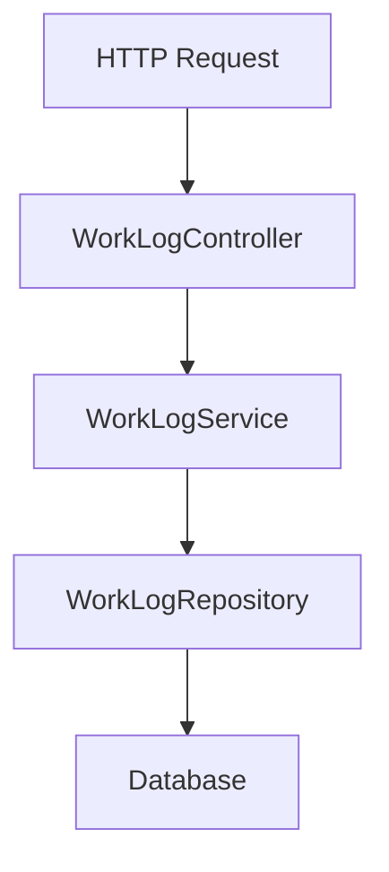

# WorkLog CRUD API設計

## WorkLogの設計方針

WorkLogは、**Projectに紐づく作業記録** として扱います。

```text
Project 1 --- * WorkLog
```

つまり、1つの案件に対して複数の作業記録を登録できます。

## 対象データ

WorkLogは、Projectに紐づく作業記録を表します。

| 項目 | 型 | 必須 | 説明 |
| --- | --- | ---: | --- |
| id | Long | ○ | 作業記録ID |
| project | Project | ○ | 紐づく案件 |
| workDate | LocalDate | ○ | 作業日 |
| hours | BigDecimal | ○ | 作業時間 |
| description | String | - | 作業内容 |
| createdAt | LocalDateTime | ○ | 作成日時 |
| updatedAt | LocalDateTime | ○ | 更新日時 |

## API一覧

| メソッド | パス | 説明 |
| --- | --- | --- |
| POST | `/api/projects/{projectId}/work-logs` | 作業記録を登録する |
| GET | `/api/projects/{projectId}/work-logs` | 指定した案件に紐づく作業記録一覧を取得する |
| GET | `/api/work-logs/{id}` | 指定した作業記録を取得する |
| PUT | `/api/work-logs/{id}` | 指定した作業記録を更新する |
| DELETE | `/api/work-logs/{id}` | 指定した作業記録を削除する |

## パッケージ構成

- 作業記録の登録と作業記録一覧取得は`project`配下に実装する
- 作業記録の取得、更新、削除は`work-log`配下に実装する

## 各クラスの役割

| クラス | 役割 |
| --- | --- |
| WorkLog | 作業記録を表すEntity |
| WorkLogRepository | WorkLogのDB操作を担当するRepository |
| WorkLogService | WorkLogに関する業務処理を担当するService |
| WorkLogController | HTTPリクエストを受け付けるController |
| WorkLogCreateRequest | 登録APIのリクエストDTO |
| WorkLogUpdateRequest | 更新APIのリクエストDTO |
| WorkLogResponse | レスポンスDTO |

## 処理の流れ



## リクエスト例

- 登録

```json
{
  "workDate": "2026-06-03",
  "hours": 7.5,
  "description": "案件管理APIのProject CRUD実装とテスト作成"
}
```

## レスポンス例

- 登録

```json
{
  "id": 1,
  "projectId": 1,
  "workDate": "2026-06-03",
  "hours": 7.5,
  "description": "案件管理APIのProject CRUD実装とテスト作成",
  "createdAt": "2026-06-03T22:00:00",
  "updatedAt": "2026-06-03T22:00:00"
}
```
